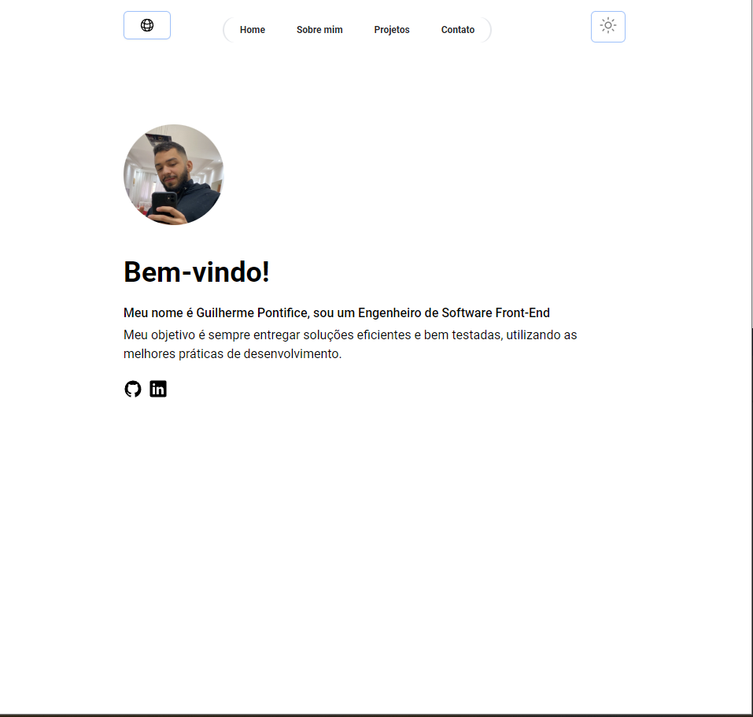
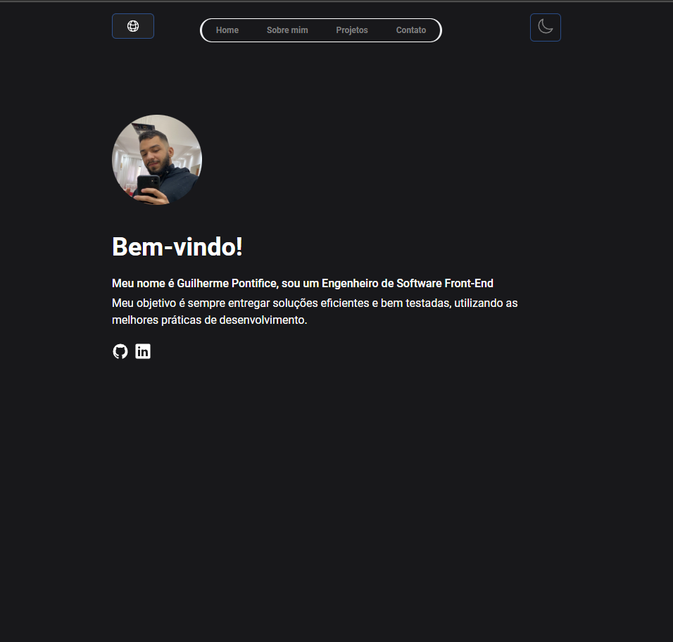

# Meu Portfólio

Bem-vindo ao meu portfólio! Este é o repositório que contém o código-fonte do meu site pessoal, onde compartilho informações sobre mim, meus projetos e como entrar em contato.

 

## Tecnologias Utilizadas

- **React:** A biblioteca JavaScript para construção da interface do usuário.
- **React-i18next:** Para suporte a internacionalização (i18n).
- **Email.js:** Para lidar com o formulário de contato via e-mail.
- **Tailwind CSS:** Um framework de utilitários CSS para estilização rápida e responsiva.

## Estrutura do Projeto

O projeto está organizado da seguinte maneira:

- `src/components`: Contém os componentes React utilizados nas diferentes seções do site.
- `public/assets/images`: Armazena as imagens utilizadas no site.

## Como Executar Localmente

Clone o repositório:
   ```bash
   git clone https://github.com/seu-usuario/meu-portfolio.git
   cd meu-portfolio
   ```
Instale as dependências:
```bash
npm install
Inicie o aplicativo localmente:
```

### O site estará disponível em http://localhost:3000.


## Contribuições
Contribuições são bem-vindas! Sinta-se à vontade para abrir problemas ou enviar solicitações de pull.

##
## Guilherme Pontifice 
### https://guipontifice.github.io/portfolio/
### https://www.linkedin.com/in/guilhermepontifice/


## Licença
Este projeto é licenciado sob a Licença MIT - consulte o arquivo LICENSE.md para obter detalhes.
